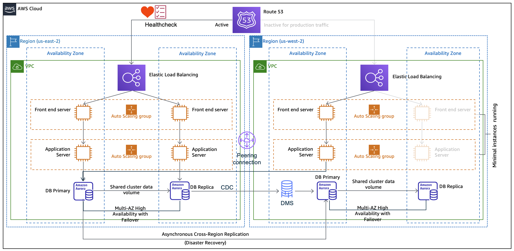

# Multi-Region Active-Active Architectures using AWS Fargate and RDS

The project deploys a multi-region active-active Java-based microservice using a CI/CD pipeline. The design includes regional active-active databases with change-data-capture (CDC) for lowest RTO (<15 mins).

